```{r child='A2.Rmd', include=FALSE, eval=TRUE}
```


# Decription of article 
The of the most dynamic cell populations found in turmous are leukocytes. They play a very important role in normal breast tissue remodeling during pregnancy and involution. This study performed a gene expression analysis in leukocytes sorted from normal breast tissues, ductal carcinomas in situ (DCIS), and HER2+ and triple negative invasive ductal carcinomas (IDC). It focuses on the immune escape during breast tumor progression. 

About the dataset

This study performed RNA-seq on purified CD45+ T cells from normal breast tissues (n=12),DCIS (n=11), and IDC (n=12), focusing on HER2+CD3+ (n=5) and TN (n=6) IDC cases.
RNA was isolated from purified CD45+CD3+ leukocytes by cell sorting.

Source name	resected breast tumor
Organism	Homo sapiens
Characteristics	tissue of origin: breast (tumor)
cell type: CD45+CD3+ T cell
breast tumor subtype: DCIS/ IDC/ None

Results from A2
Created edgeR object using DGEList and define model matrix to make a contrast table (normal subtypes vs DCIS and IDC subtypes) to see how the differential expression level of the normal(unaffected) subtypes and DCIS and IDC subtypes (affected). We used the package edgeR and Quasi liklihood method to calculate the differential expression. The heatmap also shows the different degree of expressiona level expressed in normal/unaffected vs other affected. Upregulated and downregulated genes from the calcuation have been saved and also output a ranked-gene list for further analysis purposes. Thresholded Over-representation analysis is also performed using g:profiler. 

# Non-thresholded Gene set Enrichment Analysis

Non-thresholded gene set enrichment analysis is performed using GSEA v4.0.3. The text file of the ranked-list is generated from A2. The rank is calculated by log(diff_exp$PValue,base =10) * sign(diff_exp$logFC). 

```{r}
head(diff_exp)

#upregulated genes
head(up_genes)

#downregulated genes
head(down_genes)
```

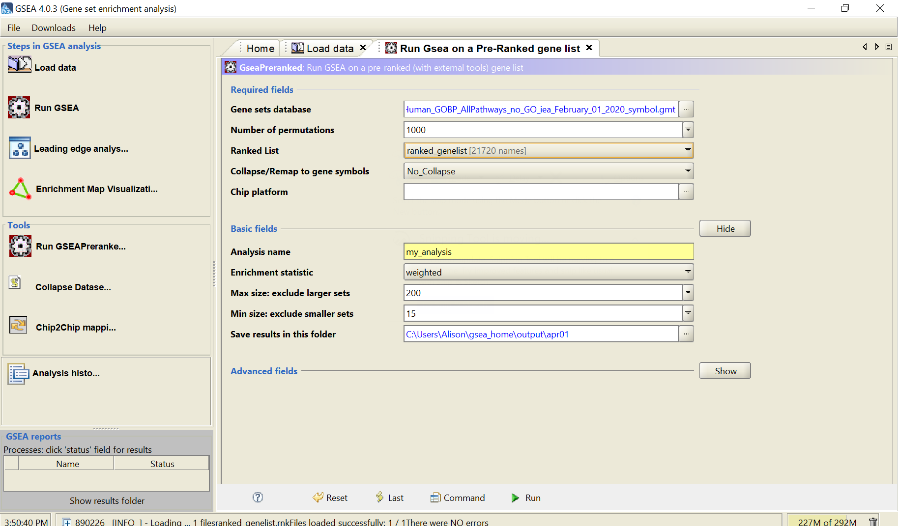


Methods: GSEA v4.0.3 for Windows

Genesets: Genesets from the baderlab geneset collection from February 1, 2020 containing GO biological process, no IEA and pathways

Version: v4.0.3


Results:

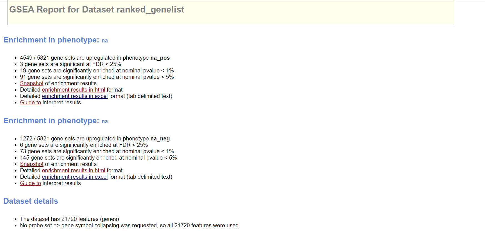


Top 10 upregualted genes:
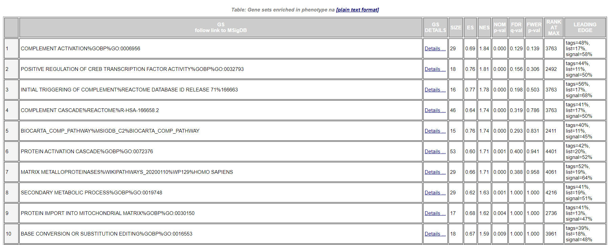

The complement system is made up of a large number of distinct plasma proteins that react with one another to opsonize pathogens and induce a series of inflammatory responses that help to fight infection. 

Top 10 downregulated genes:
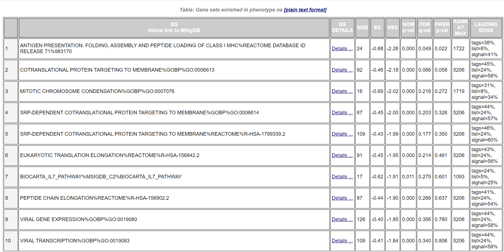

Compare results: 

From A2, we perfromed a enrichment analysis using g:profiler. From there, the top upgregulated are: cellcular response to cytokine stimulus, response to cytokine, cytokine-mediated signaling pathway, cellcular response to tumor necrosis facr and organelle envelope.
The result from g:profiler mostly consists of cellular and biological response to cytokine which is quite different from the results from GSEA. 

# Enrichment Analysis

Enrichment Analysis is perfromed using Cytoscape 3.7.2 and the parameters are the followings:

Analysis type: GSEA

Enrichment pos: gsea_report_for_na_pos_1585770708151.xls

ENrichment neg: gsea_report_for_na_neg_1585770708151.xls

GMT: Human_GOBP_AllPathways_no_GO_iea_February_01_2020_symbol.gmt

Ranks: ranked_gene_list_na_pos_versus_na_neg_1585770708151.txt

Expression: normalized_data.txt

Phenotype: na_pos, na_neg

FDR : 0.9

All the files are used in Cytoscape are generated from GSEA except normalized_data.txt. normalized_data.txt is the differential expression that is calculated in A2 and is inputed in a text file. It consists of all the gene names and their LogFC value. FDR is chosen 0.9 instead of 1.0 because there are less noise. 


There are 463 nodes and 1469 edges showing in the network.
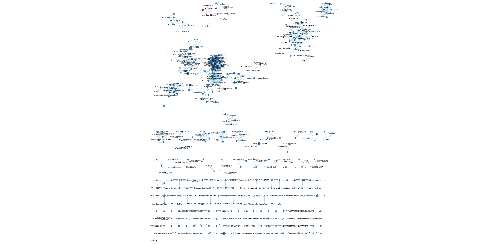


The geneset with the highest positive NES:
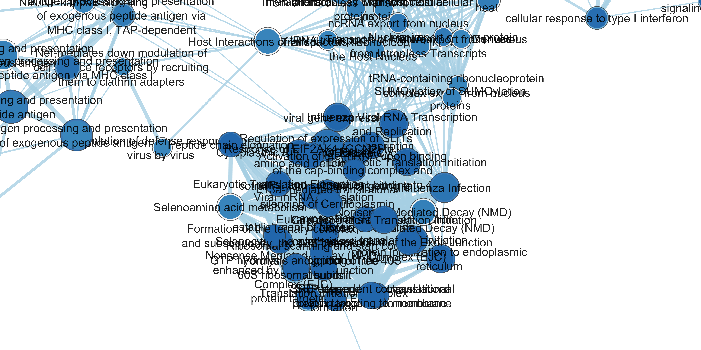

The geneset with the lowest negative NES:
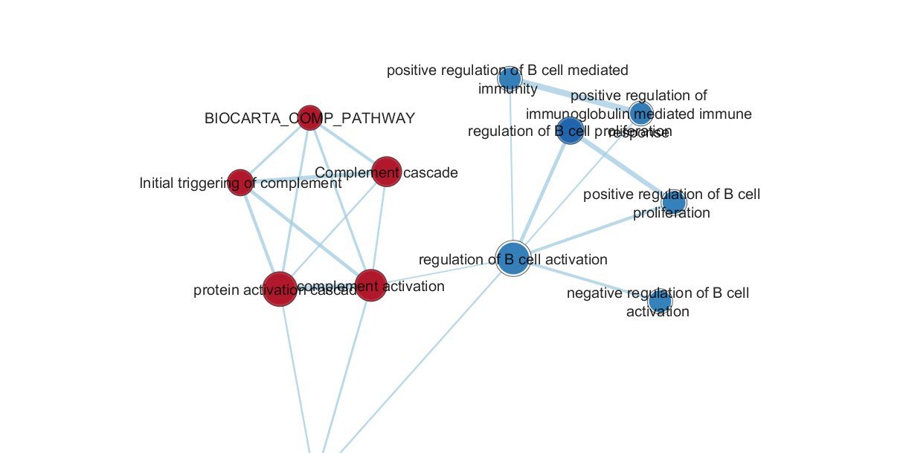

Annotated cluster:
Using the application in Cytoscape, AutoAnnotate, to create annotation set

The parameters are the followings:

Cluster Alogrithm: MLC cluster

Edge Weight column: simlarity_coefficient

Label Column: GS_DESCR

Label Algorithm: WordCloud: Adjacent Words

Max Word per lable: 3

Adjacent word bonus: 8


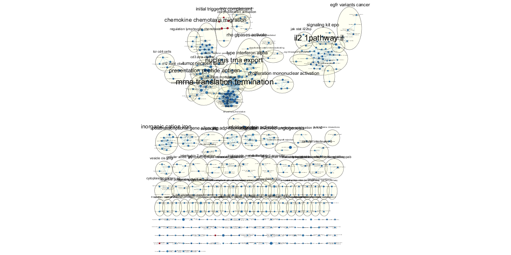

The annotation network has 90 clusters. The range size of the clusters is from 2 nodes to 33 nodes. 

The top 3 largest upregulated cluster: 

mrna translation termination,

il2 1pathway il,

nucleus trna export

The first two cluster is mentioned in the article.
Differences between HER2 and TN IDC included the upregulation of pathways signaling for IL6, IL7, CTLA-4, and antigen-presentation by MHC I in TN cases. Also enriched were gene sets corresponding to cell signaling pathways, transcription and translation, and cell cycle in the HER2+ /TN IDC comparison, suggesting potential T cell expansion. Overall, these results suggest a more inflammatory and more immunosuppressive environment in IDCs compared to DCIS, especially in TN tumors.(Alcazar, 2017)

1 major downregulated cluster:
chemokine chemotaxis migration


Putting the annoatated network into theme
Go to AutoAnnotate panel to Create Summary Network, then select Clusters and Unclustered Nodes

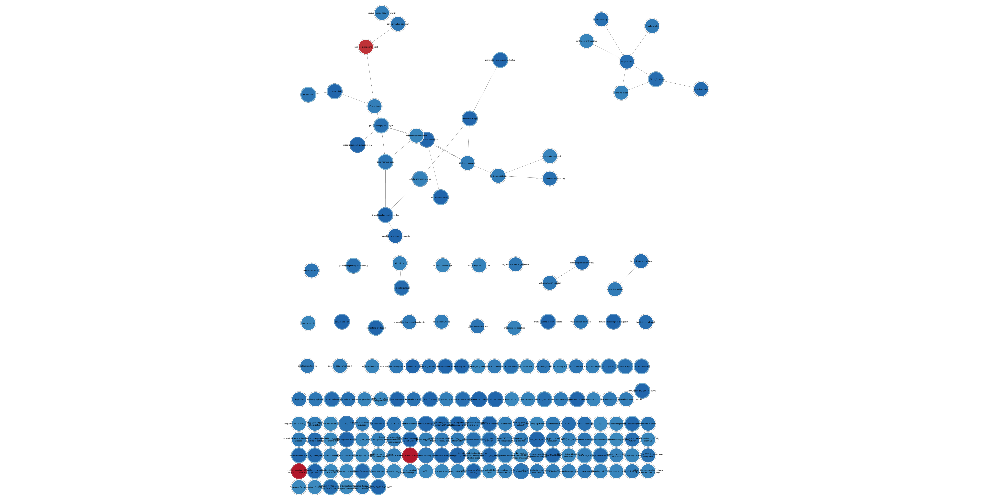

Now, we have a more clear view. In the network, we have 189 nodes and 33 edges. 34 of all nodes are not clustered together and the rest are clusted and linked together. 


# Wikipathway

From the GSEA reault, we can see MATRIX METALLOPROTEINASES pathway is in the top 10 upgregulated list. The MMP family and their inhibitor play a very important role multiple biological functions in all stages of cancer development. The stages of cancer developement include initiation to outgrowth of clinically relevant metastases and likewise in apoptosis and angiogenesis.(Jabłońska-Trypuć, 2016) They invlolve in morphogenesis, wound healing, tissue repair and remodelling in response to injury, e.g. after myocardial infarction, and in progression of diseases such as atheroma, arthritis, cancer and chronic tissue ulcers. hey are multi-domain proteins and their activities are regulated by tissue inhibitors of metalloproteinases (TIMPs) (Nagase 2006). MMPs and their inhibitors are crucital to many researchers and are investigated to be an anticancer drug. 


Import the network from Public database, searched the pathway by Wikipathway and entered WP129

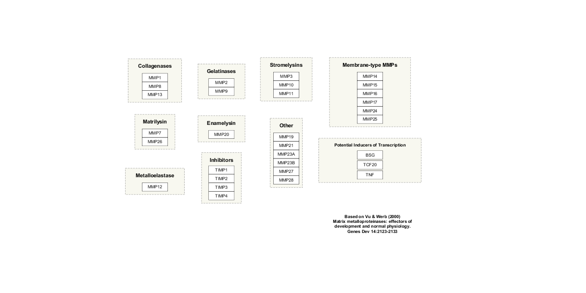

Import the differential expression data (normalized_data.txt) to the pathway
Change the color of the enzymes according to the expression level from normalized_data.txt

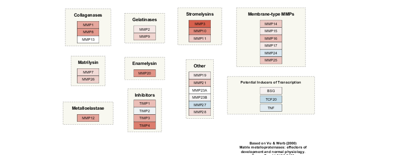


MMP3 and TIMP4 show the highest expression value and TCF20 shows the lowerst expression value

In the article, MMPs are not mentioned in the paper but from the results from A2, it is one of the most abundant family expressed in the dcis and IDC features. MMP3 involves in the breakdown of extracellular matrix in normal physiological processes, such as embryonic development, reproduction, and tissue remodeling, as well as in disease processes, such as arthritis and metastasis.As TIMP4 is the inhibitor of the matrix metalloproteinases which involves in degradation of the extracellular matrix. On the other hand, TCF20 is downregualted and is transcriptional coactivator and can enhance the activity of transcription factors. Mutation on this protein can lead to autism spectrum disorders which is less related to our article. 


